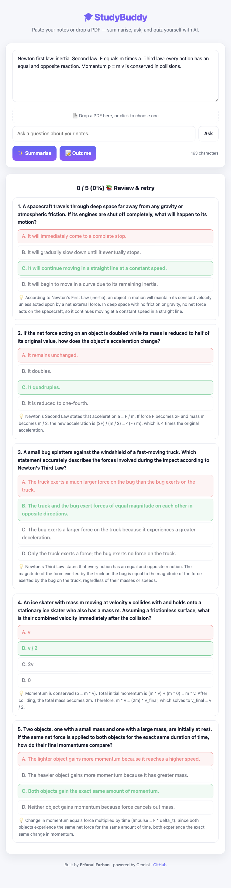

# 🎓 StudyBuddy — AI study companion

Paste your notes or drop a PDF, and StudyBuddy will **summarise** them into clean
revision notes, **answer questions** about them, and generate an **interactive
quiz** to test yourself — all powered by Google Gemini.

**Live demo:** _deploy to Vercel in ~2 minutes (below) and drop the link here._



## Features

- **📄 PDF or paste** — drop a lecture PDF (text extracted in-browser with
  pdf.js) or paste any notes / article / chapter.
- **✨ Summarise** — turns a wall of text into organised, bulleted revision
  notes with the key terms highlighted.
- **💬 Ask** — answers questions grounded in your notes.
- **📝 Quiz me** — generates conceptual multiple-choice questions (understanding,
  not trivia), with instant grading, explanations, and a score.

## How it's built

| Layer | |
| --- | --- |
| Front-end | Vanilla HTML/CSS/JS — no framework, fully responsive, light/dark |
| PDF | `pdf.js` extracts text **in the browser** (no uploads) |
| API | A single Vercel serverless function (`/api/study`) |
| AI | Google Gemini (`gemini-flash-latest`), with retry/back-off on rate-limits and model overload |

**The API key never touches the browser.** The page sends only note text to the
serverless function, which calls Gemini with the key from a server-side
environment variable.

## Run locally

```sh
git clone https://github.com/erfanulfarhan/studybuddy-ai.git
cd studybuddy-ai
export GEMINI_API_KEY="your-key"     # from https://aistudio.google.com/app/apikey
node server.js                       # http://localhost:3000
```

`server.js` is a small dev server; in production Vercel serves `index.html` and
runs `api/study.js` as a serverless function.

## Deploy (free, permanent URL)

1. Push this repo to your GitHub.
2. On [vercel.com](https://vercel.com) → **New Project** → import the repo.
3. Add an environment variable **`GEMINI_API_KEY`** = your key.
4. **Deploy.** You get a permanent `https://studybuddy-…vercel.app` URL.

No build step, no server to manage — Vercel hosts the static page and the
serverless function together.

## Notes

- Uses the free Gemini tier, which rate-limits under rapid use — the API retries
  and, if the model is briefly overloaded, tells you to try again shortly.
- Sensible request cap (~30k chars of notes per call) keeps things fast.

---

Built by **Erfanul Farhan** · [GitHub](https://github.com/erfanulfarhan)
